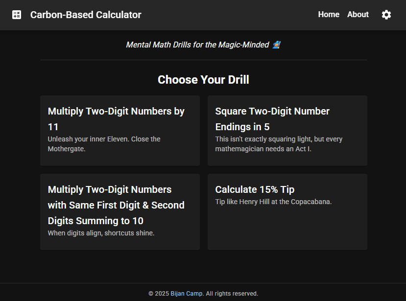

# Carbon-Based Calculator

A web app that provides mental math drills for the magic-minded. Choose from
curated drill types—like multiplying by 11 or squaring numbers ending in 5—and
train yourself to calculate more quickly, easily, and *mathemagically*.

## Project Structure

This repository is organized as follows:
- `/` – Project root. Contains `azure.yaml` and other top-level config files.
- `.devcontainer/` – Dev container configuration files.
- `infra/` – Infrastructure as code written in Bicep.
- `src/web/` – Source code for the web application (frontend).
